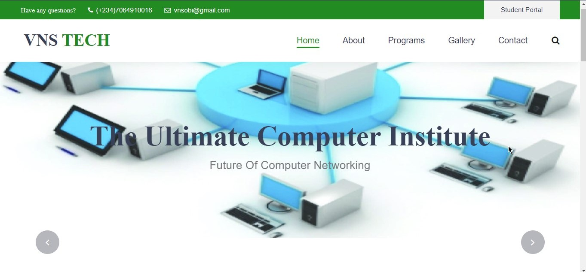

<h2 align="center">
  Tech Academy Web Template 
  <a href="#" target="_blank">VnsObi</a>
</h2>

  

 

 &nbsp;

<h3 align="center">
    🔹
    <a href="https://github.com/VnsObi/Portfolio/issues">Report Bug</a> &nbsp; &nbsp;
    🔹
    <a href="https://github.com/VnsObi/Portfolio/issues">Request Feature</a>
</h3>

## About

HTML, CSS, and JavaScript files: These are the core components of a frontend design project and are responsible for the structure, styling, and behavior of the project.

## Features

**📖 Multi-Page Layout**

**🎨 Styled with CSS Bootstrap and Css with easy to customize colors**

## Getting Started

Clone down this repository. Edit to your heart satisfaction

### Show your support

Give a ⭐ if you like this website!

